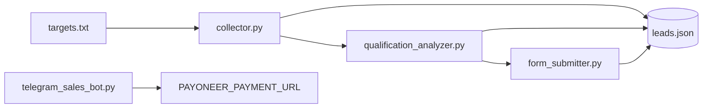

# Nirvana — 22'li otonom modül mimarisi (maliyetsiz / kotasız)

| Lane | Modül | Host | Zamanlama |
|------|-------|------|-----------|
| A | `discovery_agent` | GitHub Actions | `11 */6 * * *` |
| B | `enrichment_agent` | GitHub Actions | `23 */6 * * *` |
| C | `audit_verifier_agent` | GitHub Actions | `41 */6 * * *` |
| D | `strategy_pivot_agent` | GitHub Actions | günlük `17 3 * * *` |
| E | `objection_handler_agent` | GitHub Actions / Telegram | olay bazlı |
| F | `onboarding_agent` | Oracle VM | ödeme doğrulaması sonrası |
| G | `delivery_runner` | Oracle VM | haftalık Pazartesi 06:00 UTC |
| H | `retention_agent` | GitHub Actions | aylık `17 9 1 * *` |
| I | `watchdog_quota_agent` | Oracle VM | `*/5` dakika |
| J | `linkedin_router` | Oracle VM | günlük `0 8 * * *` |
| K | `meta_orchestrator` | GitHub Actions | günlük `31 4 * * *` |
| L | `micro_audit_proof_agent` | GitHub Actions | günlük `23 5 * * *` |
| M | `retainer_report_agent` | GitHub Actions | günlük `47 5 * * *` |
| N | `contract_pack` | Oracle VM | sözleşme evresinde |
| O | `stealth_former` | GitHub Actions | `*/4 * * * *` |
| P | `message_optimizer` | GitHub Actions | günlük `7 4 * * *` |
| Q | `github_orchestrator` | Oracle VM | olay bazlı |
| R | `email_infra_audit` | GitHub Actions | günlük `12 4 * * *` |
| S | `tech_stack_detector` | GitHub Actions | günlük `29 4 * * *` |
| T | `service_readiness` | GitHub Actions | günlük `37 4 * * *` |
| U | `multi_service_runner` | Oracle VM | olay bazlı |
| V | `free_captcha_solver` | GitHub Actions | `*/4 * * * *` |
| AL | `keepalive_guard` | GitHub Actions | günlük `0 6 * * *` |
| AM | `idle_guard` | Oracle VM | `*/10 * * * *` |

- Kayıt defteri: `nirvana/nirvana.yaml` — tek doğruluk kaynağı (host, schedule, entrypoint).
- CLI: `python -m nirvana.runner <modul>` (tüm lane'ler), `--list` ile envanter.
- Ödeme: 2.500 EUR Payoneer retainer; link `PAYONEER_PAYMENT_URL` (Oracle `.env`), tutar/para birimi `PAYMENT_AMOUNT`/`PAYMENT_CURRENCY`. Link yer tutucuyken ödeme akışları çalışmaz (`nirvana/payment.py`).
- Oracle canlıya alma: `sudo bash oracle/nirvana_oracle_install.sh` (unit+timer kurar, watchdog dry-run ile doğrular).
- Heavy işler GitHub'da; Oracle yalnız doğrulanmış kuyruğu (`nirvana/state/verified_queue.json`) ve hafif timer'ları çalıştırır — Always-Free kotası korunur.

## Kesintisizlik ve $0 altyapı güvenceleri

| Kriter | Mekanizma |
|--------|-----------|
| GitHub Actions 60 gün pasifleşme | `nirvana/keepalive_guard.py` + `.github/workflows/keepalive.yml`: son depo etkinliği ölçülür, pencere (20–40 gün) dolunca contents API ile mikro commit atılır. Boşluk bırakılmaz, maliyet $0. |
| OCI Always-Free idle geri alımı | `nirvana/idle_guard.py` + `oracle/nirvana-idleguard.timer` (10 dk): CPU/bellek alt eşiğin (%20) altına düşerse **Nice=19** hafif sentetik yük üretilir; `watchdog_quota_agent` üst tavanı (%85) korur. İkisi ne bosta kalır ne limite dayanır. |
| Cron kademelendirme (3-4 saat keşif; 30/40/60 dk modüller) | `oracle/dispatch_hub.py` `DISPATCH_MATRIX` + `oracle/nirvana-dispatch.timer` (1 saat): CDX filoları 3-3.5-4 saat (birbirinden ayrık, cascade yok), discovery-pipeline 1 saat, watchdog'lar 30 dk, payload_optimizer 40 dk, enterprise-feed 60 dk, ağır zincir 2 saat. GitHub cron'u yedek katman. |
| Acil yakıt ikmali (kuyruk <100) | `nirvana/queue_fuel_guard.py`: `CRITICAL_WATERMARK=100`, `EMERGENCY_ADD=500`; kritikte `EMERGENCY_REFILL_REQUIRED` bayrağı + `workflow_dispatch` ile `refill_batch=500`. |
| Telegram flood/ban koruması | `flood_guard.py` (hız sınırı + `RetryAfter` kapısı, bot havuzu dağıtımı) + opsiyonel **Local Bot API** (`telegram_bot_api.py`, `docker-compose.yml`): dakikada-30-mesaj ve 20 MB sınırı kalkar, sunucu sağlıksızsa otomatik buluta düşer. Kurulum: `oracle/TELEGRAM_LOCAL_BOT_API.md`. |
| Yönetici tanıma | `/notifyme <TELEGRAM_ADMIN_TOKEN>` → "Sistem Sahibi Taptaze Senkronize Edildi"; `TELEGRAM_ADMIN_ID` + `TELEGRAM_OWNER_CHAT_ID` + `owner.json` birlikte okunur (`owner_notify.load_admin_chat_ids`). Müşteri sohbeti asla operatör sayılmaz. |
| İnsan devri (butonlu) | Canlı müşteri talebinde bildirim, `[💬 Sohbete Bağlan / Reply]` inline butonu ile gider; patron bastığı anda `telegram_sessions.arm_reply` devri açar, otonom yanıtlayıcı durur ve patronun yazdığı mesaj doğrudan müşteriye iletilir (`/disarm` ile geri verilir). Buton gönderilemezse `/reply CHATID metin` yedeği çalışır. |
| Kendini onarma | systemd `Type=notify` + `WatchdogSec` (`nirvana-salesbot.service`), `heartbeat.py`, `circuit_breaker.py`, `task_queue.py` (bildirimler kuyruğa alınır, hat dönünce iletilir). |
| Form hattı (400/gün) | `nirvana-pipeline.service` (Oracle): `auto_runner.py` döngüsü — feed senkronu → nitelendirme → `pipeline.py --submit`. Kurulumla gelir (`nirvana_oracle_install.sh`), `Restart=always` + `RuntimeMaxSec=4h`; tur başına duvar-saati sınırı `PIPELINE_RUN_TIMEOUT_SECONDS` (takılı Chromium hattı kilitleyemez). Legacy `devsolve-runner.service`/`devsolve-bot.service` çift gönderim olmasın diye kapatılır. |
| Bot havuzu | `TELEGRAM_BOT_TOKEN` + `TELEGRAM_BOT_TOKENS` (alias: `TELEGRAM_OTHER_BOT_TOKENS`): her token ayrı Application, tek süreç/tek state. `config.resolve_bot_pool()` getMe ile username'leri çözer; `bot_registry.py` PASSIVE/ACTIVE tutar; form linki yalnız ACTIVE botlardan (`config.next_bot_username`). |
| Bot id'si ≠ sahip | `config.known_bot_ids()` token öneki + getMe kaydından (`nirvana/state/bot_ids.json`) bot id'lerini toplar; `owner_notify.load_admin_chat_ids()` bu id'leri operatör listesinden çıkarır. `TELEGRAM_BOT_TOKEN` id'siz girilirse (`:<secret>`) `TELEGRAM_BOT_ID` → kayıtlı id → (legacy) owner chat id sırasıyla tamamlanır. |

---

# B2B Lead Qualification & Telegram Sales Engine

Modular Python toolkit that:

1. Collects public company copy and contact-form metadata from a URL list
2. Scores each site against your ICP with OpenAI (`gpt-4o-mini`, JSON mode)
3. Optionally posts a personalized pitch to a discovered contact form
4. Runs an inbound Telegram bot that answers questions and shares a Payoneer link only after purchase intent



`pipeline.py` is the outbound orchestrator. `telegram_sales_bot.py` is a separate long-running process.

## Responsible use

Use this only on websites and inboxes you are authorized to contact, and only in ways that comply with applicable anti-spam, privacy, and computer-access laws (including consent / lawful-basis rules in your jurisdiction). The submitter **does not** solve CAPTCHAs, log into accounts, or bypass access controls — protected forms are skipped. Form posting is opt-in (`--submit`); the default pipeline run only collects and qualifies.

The bounded agent layer names a platform only after multiple source-level markers reach the 95% confidence policy; otherwise it uses a neutral engineering hook. A form is counted as confirmed only after a non-analytics 2xx network response, and all browser work remains time-bounded. Public discovery rows with easy_score ≥80 are auto-approved from review_queue into authorized_targets with zero delay; opt-out, CAPTCHA, and daily/hourly caps remain the spam controls.

## Discovery feeds

GitHub Actions runs 250 logical Common Crawl shards through five bounded, staggered fleet workflows, refreshing each family every 30 minutes. Shards write only `feeds/shards/`; the single serialized publisher validates, deduplicates, builds `feeds/ready_queue.json`, and performs one atomic Oracle sync, so discovery does not consume the Oracle HTTP probe budget. A low-watermark workflow starts one family early when Oracle fuel falls below 80, without requeueing submitted or opted-out hosts. Tranco sitemap discovery is sequential and capped; Google scraping and unlicensed data-provider APIs are intentionally not used.

The hourly `payload-optimizer` workflow runs on GitHub runners (not Oracle): it fetches HTML for score ≥85 discovery candidates, analyzes platform/SEO/checkout gaps, pre-builds personalized form hooks and Telegram `/start` handoffs, then pushes the batch to Oracle `POST /api/v1/ingest` over SSH localhost. Oracle stores the payloads in `feeds/optimized_cache.json` and enqueues them with `authorized_contact=true` without spending HTTP probe budget on discovery fetches.

## Layout

| File | Role |
|------|------|
| `config.py` | Loads `.env` (`OPENAI_API_KEY`, `TELEGRAM_BOT_TOKEN`, `PAYONEER_PAYMENT_URL`, product/ICP/sender fields) |
| `collector.py` | Playwright scan: description, company name, contact form, CAPTCHA flag |
| `qualification_analyzer.py` | `fit_score` 0–100 + Telegram-directed value proposition |
| `form_submitter.py` | Maps fields, waits 5–12s, submits; skips CAPTCHA / missing forms |
| `telegram_sales_bot.py` | Inbound sales chat; payment URL only on purchase intent |
| `pipeline.py` | Orchestrates collect → qualify → optional submit; writes `leads.json` |

## Setup

Python 3.10+ recommended.

```powershell
cd $env:USERPROFILE\lead-qualification-engine
python -m venv .venv
.\.venv\Scripts\Activate.ps1
pip install -r requirements.txt
playwright install chromium
copy .env.example .env
copy targets.example.txt targets.txt
```

Edit `.env` with real keys and your product/ICP copy. Edit `targets.txt` with authorized URLs (one per line).

Create a bot with [@BotFather](https://t.me/BotFather), paste the token as `TELEGRAM_BOT_TOKEN`, and set `TELEGRAM_BOT_USERNAME` to the bot username without `@`.

## Run the pipeline

Qualify only (no form posts):

```powershell
python pipeline.py --targets targets.txt
```

Qualify and submit forms that pass `MIN_FIT_SCORE`:

```powershell
python pipeline.py --targets targets.txt --submit
```

Useful flags:

- `--limit 3` — first N targets
- `--min-score 80` — override `.env`
- `--headful` — visible browser
- `--leads path\to\leads.json` — state file

State is saved after every lead so a crash can be resumed. Status values include `collected`, `qualified`, `submitted`, `submitted_unconfirmed`, `skipped_captcha_detected`, `skipped_no_contact_form`, `failed`.

## Run the Telegram bot

```powershell
python telegram_sales_bot.py
```

The bot keeps a short per-chat memory, answers in JSON mode internally, and appends `PAYONEER_PAYMENT_URL` only when the model flags purchase intent (or the user clearly asks how to pay).

## Lead record shape

Each object in `leads.json` looks like:

```json
{
  "url": "https://example.com",
  "company_name": "Example",
  "description": "...",
  "page_excerpt": "...",
  "contact_form": {
    "found": true,
    "page_url": "https://example.com/contact",
    "fields": [{"name": "email", "purpose": "email"}]
  },
  "captcha_detected": false,
  "fit_score": 72,
  "fit_rationale": "...",
  "value_proposition": "...",
  "should_contact": true,
  "status": "qualified",
  "updated_at": "2026-08-22T12:00:00+00:00"
}
```

## Modules as CLIs

```powershell
python collector.py https://example.com
python qualification_analyzer.py
python telegram_sales_bot.py
```
